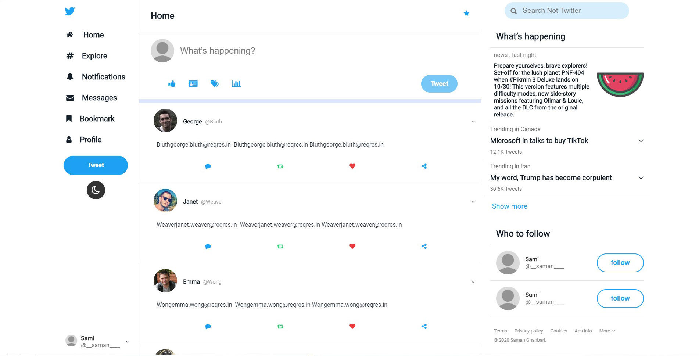
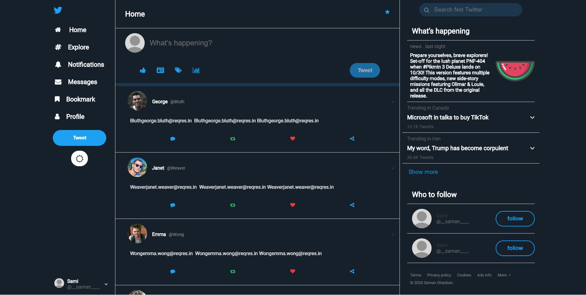
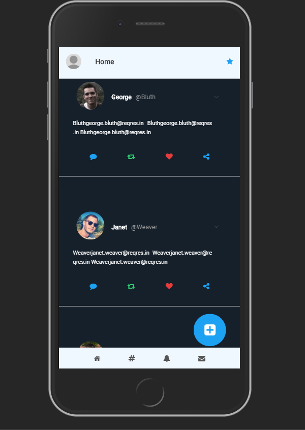

# Twitter imitation By the HomePage with infinit posts
## So i challenged myself to create the Twitter's homepage from scratch
## and i gotto say it's more work that it looks

# Another side project 
## I thought it would be fun and skill sharpening
## and tried it to be responsive, and i added side menu and a lot more ...
## and i used the best API i could find at the time, and that's **https://reqres.in**
# some of the **Features** :
### when u reach at the end of posts it should load more posts in 1000ms
### You can search through tweet usernames, names, and text content
### theming Feature : you can switch between light mode (default) and Dim mode as in the picture below

### and last but not least, **responsiveness** as for small devices and phones like below

# downsides of this:
### i tried to get real twitter Api and fetch **Real Data**
### and requested twitter.com, and i'm yet waiting for response to let me use their API
### so, I'm probably gonna make it better if they let me